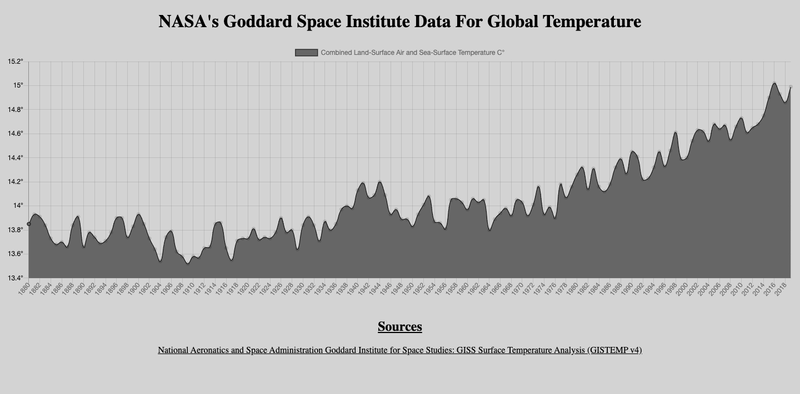

### This application visualizes all of NASA's land-surface and sea-surface global temperature from 1880 - present. This brings awareness to pollution and the impact of Carbon Dioxide in our ecosystem. 

# See Live Demo --> https://giss-temperature-data.netlify.app/

